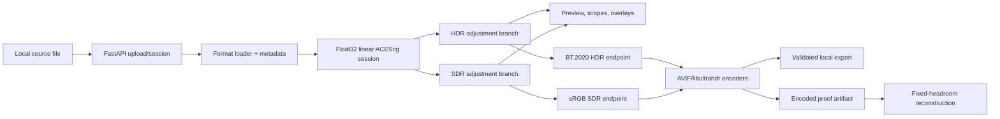

# Architecture and Data Flow

HDR Finisher is a local web application packaged as a desktop-like tool. Python owns file decoding, color processing, authoritative rendering, scopes, proofing, and export. A browser owns the interface and HDR-capable viewport.

## Why this architecture

- Python and NumPy make floating-point image processing readable and testable.
- colour-science provides well-defined color-space and transfer conversions.
- A browser provides a portable UI, GPU canvas access, responsive layout, and a current HDR image presentation path.
- FastAPI makes the processing functions available through explicit local endpoints without introducing a database.
- Native command-line encoders can be pinned, capability-checked, and independently validated.

The tradeoff is that OS, browser, GPU, and display behavior become part of preview and proofing. Export computation remains on the backend to keep the delivery result deterministic.

## Data flow

## Backend components

| Module | Responsibility |
|---|---|
| `main.py` | FastAPI application, routes, errors, static frontend, server startup |
| `loader.py` | Container decoding, EXR/HEIF/TIFF handling, metadata, Apple HDR reconstruction |
| `color.py` | Source detection, normalization, RGB conversions, primaries adjustment matrix |
| `analysis.py` | HDR classification and source-latitude summary |
| `adjustments.py` | HDR/SDR creative processing and curve/equalizer math |
| `preview.py` | Proof-oriented PNG/AVIF encoding, raw RGBA8 fallback transport, proxy downsampling |
| `render_cache.py` | Byte-budgeted processed/proxy/scope caches, single-flight work, RGBA16F/RGBA32F transport |
| `scopes.py` | Vectorized histograms/waveforms, peak/clipping data, reference-nit statistics |
| `overlay.py` | False-color and zebra images |
| `exporters.py` | SDR PNG, AVIF gain map, JPEG Ultra HDR, staging and validation |
| `proofing.py` | Encoded proof artifacts, gain-map reconstruction, evidence records |
| `display_probe.py` | Read-only Windows QueryDisplayConfig/DXGI telemetry |
| `capabilities.py` / `binaries.py` | Optional library and encoder discovery |
| `sessions.py` | In-memory active session and owned temporary-source lifecycle |
| `hosting_probe.py` | Local/remote delivery inspection and metadata survival |

## Frontend components

- `index.html`: four-stage workflow and accessible control structure.
- `styles.css`: panel layout, resizable rails/dock, responsive behavior, visual state.
- `app.js`: session state, scheduler integration, scopes, overlays, curves, equalizer, export UI.
- `preview-scheduler.js`: animation-frame coalescing, tiered scope timing, settle/refinement priority, generation state.
- `webgpu-preview.js`: settled authoring renderer using reusable buffers/bind groups and guarded half-float proxies.
- `proofing-ui.js`: proof artifact controls, reconstruction state, and observation workflow.

The frontend deliberately has no build framework. This keeps packaging and offline operation simple, but places more state coordination in plain JavaScript.

## Session lifecycle

An imported upload is copied into a temporary owned source, decoded, normalized, and stored in an in-memory session. The session contains:

- Source descriptor and metadata
- Normalized ACEScg image
- Optional authored SDR reference image
- HDR analysis/classification
- Current adjustments
- Preview settings and capabilities
- Render cache

There is no database and no persistent project-file format. Ejecting/replacing the session discards unsaved adjustments. Reloading or restarting also resets interface preferences and layout to canonical defaults. Exports and manually recorded proof evidence are the durable artifacts.

## Preview scheduling

The interaction-aware scheduler coalesces control input to one WebGPU render per animation frame. Interactive scope work is throttled, normal settling follows after roughly 110 ms idle, and optional high-quality refinement follows only after longer idle. Image, scope, refinement, and inactive-lane work have separate generations; requests are abortable and stale results are rejected by both frontend and backend checks.

The validated WebGPU surface remains the settled authoring preview for HDR and SDR. Source proxies prefer aligned RGBA16F and fall back to RGBA32F for non-finite or out-of-range values. The renderer writes the active branch through Curves into an RGBA16F intermediate, applies Film Response into a second intermediate, then extracts qualified highlight energy into a quarter-resolution RGBA16F surface. Separable Gaussian passes blur Bloom RGB and Halation luma at their independent radii before the full-resolution composite applies diffusion, Image Structure, and seeded Grain. The CPU renderer uses a dense three-pass Gaussian approximation with the same linear-light compositing semantics. Parameters, reference constants, and ordering mirror the CPU processor; the backend remains authoritative for proof and export.

Fallback scopes use vectorized bin-index generation and `numpy.bincount`. Scope results and adjusted frames are single-flight and cached by source state, lane, proxy level, dimensions, and adjustment signature. Cache diagnostics report managed bytes, hits, misses, evictions, in-flight work, and stale cancellations.

## API shape

Major route groups:

- `/api/session`: import, fetch, clear, reinterpret
- `/api/session/{id}/preview|preview-raw|overlay|scopes|proxy|diagnostics`: processed views, raw fallback, proxies, and cache diagnostics
- `/api/session/{id}/export`: validated final output
- `/api/proof/*`: proof artifacts, reconstruction, tiles, evidence, test pattern
- `/api/display`: native display telemetry where supported
- `/api/capabilities`: optional backend availability
- `/api/export-directory`: native directory selection

Pydantic models validate adjustment ranges and request/response structures. The API is local and not designed as a hardened multi-user network service.

## External encoders

Complex delivery formats are delegated to pinned/discoverable tools:

- libavif tools: AVIF HDR alternate and gain-map assembly/inspection
- Google libultrahdr: JPEG Ultra HDR encoding/decoding

Backends stage output in temporary files, validate it, then atomically replace the destination. Capability gating keeps unavailable formats visible without pretending an encode will succeed.

## Extension points

### Add an input

Implement decoding plus explicit primaries/transfer metadata. Feed the result through `normalize_to_acescg` and add deterministic fixtures for numeric and metadata behavior.

### Add a control

Update Pydantic state, backend processing, frontend state/UI, WebGPU parity or fallback behavior, reset/modified tracking, scope expectations, tests, and this manual.

### Add an exporter

Consume full-resolution processed HDR/SDR endpoints, define color signaling exactly, stage output, inspect the encoded artifact, expose a capability, and add proofing/hosting verification.

### Use the API creatively

The local endpoints can support alternative interfaces, scripted single-image workflows, or research visualizations. They are not currently a stable public versioned API; pin to a commit and expect model evolution.

## Trust boundaries

- The application trusts the local user and local files enough to decode them with native libraries.
- It does not expose deliberate remote access or authentication.
- External hosted URL verification performs network reads and should be used only for intended delivery URLs.
- Optional native binaries are executable dependencies; use pinned builds and preserve license notices.
- Browser display output is observable behavior, not a deterministic extension of backend math.
