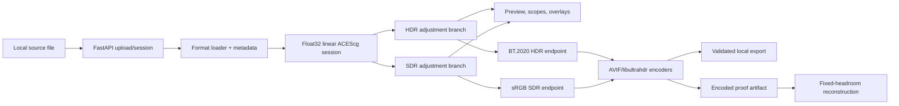

# Architecture and Data Flow

HDR Finisher is a local web application packaged as a desktop-like tool. Python owns file decoding, color processing, authoritative rendering, scopes, proofing, and export. A browser owns the interface and HDR-capable viewport.

## Why this architecture

- Python and NumPy make floating-point image processing readable and testable.
- colour-science provides well-defined color-space and transfer conversions.
- A browser provides a portable UI, GPU canvas access, responsive layout, and a current HDR image presentation path.
- FastAPI makes the processing functions available through explicit local endpoints without introducing a database.
- Native command-line encoders can be pinned, capability-checked, and independently validated.

The tradeoff is that OS, browser, GPU, and display behavior become part of preview and proofing. Export computation remains on the backend to keep the delivery result deterministic.

## Data flow

```mermaid
flowchart LR
    A["Local source file"] --> B["FastAPI upload/session"]
    B --> C["Format loader + metadata"]
    C --> D["Float32 linear ACEScg session"]
    D --> E["HDR adjustment branch"]
    D --> F["SDR adjustment branch"]
    E --> G["Preview, scopes, overlays"]
    F --> G
    E --> H["BT.2020 HDR endpoint"]
    F --> I["sRGB SDR endpoint"]
    H --> J["AVIF/libultrahdr encoders"]
    I --> J
    J --> K["Validated local export"]
    J --> L["Encoded proof artifact"]
    L --> M["Fixed-headroom reconstruction"]
```

## Backend components

| Module | Responsibility |
|---|---|
| `main.py` | FastAPI application, routes, errors, static frontend, server startup |
| `loader.py` | Container decoding, EXR/HEIF/TIFF handling, metadata, Apple HDR reconstruction |
| `color.py` | Source detection, normalization, RGB conversions, primaries adjustment matrix |
| `analysis.py` | HDR classification and source-latitude summary |
| `adjustments.py` | HDR/SDR creative processing and curve/equalizer math |
| `preview.py` | Proof-oriented PNG/AVIF encoding, raw RGBA8 fallback transport, proxy downsampling |
| `render_cache.py` | Byte-budgeted processed/proxy/scope caches, single-flight work, RGBA16F/RGBA32F transport |
| `scopes.py` | Vectorized histograms/waveforms, peak/clipping data, reference-nit statistics |
| `overlay.py` | False-color and zebra images |
| `exporters.py` | SDR JPEG/PNG, AVIF gain map, JPEG Ultra HDR, bounded SDR-guided JPEG gain-map denoising, staging and validation |
| `proofing.py` | Encoded proof artifacts, gain-map reconstruction, evidence records |
| `display_probe.py` | Read-only Windows QueryDisplayConfig/DXGI telemetry |
| `capabilities.py` / `binaries.py` | Optional library and encoder discovery |
| `sessions.py` | In-memory active session and owned temporary-source lifecycle |
| `hosting_probe.py` | Local/remote delivery inspection and metadata survival |

## Frontend components

- `index.html`: four-stage workflow and accessible control structure.
- `styles.css`: panel layout, resizable rails/dock, responsive behavior, visual state.
- `app.js`: session state, scheduler integration, scopes, overlays, curves, equalizer, export UI.
- `preview-scheduler.js`: animation-frame coalescing, tiered scope timing, settle/refinement priority, generation state.
- `webgpu-preview.js`: settled authoring renderer using reusable buffers/bind groups and guarded half-float proxies.
- `proofing-ui.js`: proof artifact controls, reconstruction state, and observation workflow.

The frontend deliberately has no build framework. This keeps packaging and offline operation simple, but places more state coordination in plain JavaScript.

## Session lifecycle

An imported upload is copied into a temporary owned source, decoded, normalized, and stored in an in-memory session. The session contains:

- Source descriptor and metadata
- Normalized ACEScg image
- Optional authored SDR reference image
- HDR analysis/classification
- Current adjustments
- Preview settings and capabilities
- Render cache

There is no database. Sessions live in memory, while `.hdrfinisher` project files persist the source reference, adjustment document, and project settings so work can be reopened. Ejecting or replacing a session discards adjustments that have not been saved to a project. Application preferences are stored separately as local desktop state. Exports and manually recorded proof evidence are additional durable artifacts.

## Preview scheduling

The interaction-aware scheduler coalesces control input to one WebGPU render per animation frame. Interactive scope work is throttled, normal settling follows after roughly 110 ms idle, and optional high-quality refinement follows only after longer idle. Image, scope, refinement, and inactive-lane work have separate generations; requests are abortable and stale results are rejected by both frontend and backend checks.

The validated WebGPU surface remains the settled authoring preview for HDR and SDR. Source proxies prefer aligned RGBA16F and fall back to RGBA32F for non-finite or out-of-range values. The renderer writes the active branch through Curves into an RGBA16F intermediate, applies Film Response into a second intermediate, then extracts qualified highlight energy into a quarter-resolution RGBA16F surface. Separable Gaussian passes blur Bloom RGB and Halation luma at their independent radii before the full-resolution composite applies diffusion, Image Structure, and seeded Grain. The CPU renderer uses a dense three-pass Gaussian approximation with the same linear-light compositing semantics. Parameters, reference constants, and ordering mirror the CPU processor; the backend remains authoritative for proof and export.

### Masks and magnified views

Export and Proof compile every mask on the CPU for the whole image; that is the reference. The preview draws a mask one of three ways, chosen per mask:

- **Soft.** The bitmap compiled for the Fit view is stretched over a magnified frame by the shader, so zooming in neither compiles nor uploads it. The backend judges each bitmap it serves (`mask_softness.py`: how sharply the bitmap bends, how far it changes at the frame edge, and what a brush's settings say about small marks) and says so in the `X-Mask-Soft` response header, with the bitmap's exact placement in a cropped frame in `X-Mask-Frame-Rect`. Anything not shown to be soft takes one of the exact paths.
- **Exact, for the visible region.** Gradient, path, unfeathered-brush and luminance masks depend on a pixel or a bounded neighbourhood, so the tile endpoint evaluates them for the rectangle around the requested tiles (`compile_geometry_fixed_mask_region`) instead of the whole image.
- **Exact, whole image.** A feathered or edge-shifted brush that is not soft depends on the painted peak of the whole image and is compiled whole, as before.

Luminance masks and simple linear gradients are also made on the GPU where their inputs are resident.

Phase 3 adds compact geometry rasterization for neutral-geometry paths and
brushes without whole-mask feather/shift. Native tiles receive geometry rather
than CPU bitmaps; eligible low-resolution Fit masks are also made on the GPU.
HDR source regions can supply leaf luminance masks with a feather halo aligned
to the full-frame downsample grid. An SDR source region serves the same way
when it is the ACEScg scene picture; a Match or authored-base region is not
scene luminance and keeps the fallback. Regional masks carry their frame placement
and use the full frame's feather distance. Editing measurement keeps its
separate bounded-mask/halo contract. Unsupported forms retain the existing
fallback; painted feather peak normalization and mask qualification are
unchanged. See [phase 3 mask evidence](viewport-phase3-mask-evidence-2026-10-02.md).

Local curves and colour wheels run on the GPU before local Detail. Curve LUTs
have a separate segment and cached samples for each active local/lane. Local
SDR colour conversion and stage clipping match export. See
[local control evidence](viewport-phase3-local-control-evidence-2026-10-02.md).

At and above 100% zoom a frame is drawn for the visible region plus a margin on the tiled route, whatever the image's size. Its source region is exactly the union of the foreground tiles' halo rectangles, fetched as row chunks side by side through a four-slot staging ring ([phase 3 zoom transfer evidence](viewport-phase3-zoom-transfer-evidence-2026-10-02.md)). Outside the tiles it has drawn, a region pass shows the last finished frame stretched. A pan draws what it exposes, and the rest of the frame is completed in the background only when that needs no mask from the backend. `readLocalMaskRegion` reads back the mask each local pass sampled, for the preview-versus-export comparison.

Fallback scopes use vectorized bin-index generation and `numpy.bincount`. Scope results and adjusted frames are single-flight and cached by source state, lane, proxy level, dimensions, and adjustment signature. Cache diagnostics report managed bytes, hits, misses, evictions, in-flight work, and stale cancellations.

Settled tiled scopes grade a separate GPU canvas capped at 1,600 instead of
starting a CPU whole-picture grade. Interactive tiled scopes wait for
settlement; direct scopes read the existing finished texture. The navigation
overview uses a separate 512-edge GPU canvas with the established SDR-display
mapping after picture/scopes settle. Auxiliary rendering preserves native
sources and visible presentation resources, checks latest state, and leaves
peak/anchor measurement on its bounded native contract. CPU rendering mode
retains its small idle overview fallback. See
[phase 3 auxiliary evidence](viewport-phase3-auxiliary-evidence-2026-10-02.md).

### Match candidates (phase 3)

Match fits editable SDR controls to the settled HDR picture by rendering
candidate recipes at a 768-pixel analysis size and measuring each. The fit
stays in `sdr_match.py`. For a plain Match under GPU rendering the page
renders the candidates: the request thread offers a recipe through
`sdr_match_remote.py`, the page collects it from
`/api/session/{id}/sdr-match/candidate`, grades it as SDR from the scene
source on a separate canvas with a shoulder anchor measured on that frame,
and returns the output-mapped picture as half-float RGB. The export pipeline
then renders the chosen recipe once; that render is the quality Match
reports and gates on. A refusal, a late answer or a rejected recipe reruns
the whole fit on the CPU. Convert and CPU rendering mode use the CPU
throughout. See [phase 3 Match evidence](viewport-phase3-match-evidence-2026-10-02.md).

The SDR base stage clips to display white only inside its active stages
(contrast, primaries, curves, colour grading), as export does, so a
highlight lifted above white reaches Detail and the locals unclipped.

### Editing peak and highlight anchors (phase 2)

The CPU collects real RGB maxima and their positions in a 64-by-64 source grid once at import. Editing transforms at most 16,384 candidates; the GPU grades and ranks them, then measures up to sixteen native 128-by-128 patches with the graph's neighbourhood. The total source-patch budget is four million pixels. Measurement masks use a 1,600-edge bitmap, or the existing qualified larger-bitmap fallback only when its bitmap fits that pixel budget. Measurement never falls back to a native whole-image render or mask. Robust anchors use a 1,600-edge proxy. Unsupported geometry or source evidence remains a refusal, not permission for an unbounded measurement.

HDR anchors measure the finished image before output compression; SDR anchors measure the earlier tone-adjusted prefix before display grading and locals. Maximum SDR anchors use the existing peak-reduction shader on the real candidate RGB values. Anchors are shared across zoom levels. The scope calls its bounded peak an estimate. Export and full-size Proof measure exactly, rederive the curve, and report a difference exceeding the owner's 1% limit. Reduced Proof does not make that comparison. Proof's artifact cache excludes the editing estimates from pixel identity and compares each caller's current estimates against the stored exact measurements.

Measurement has separate tile-graph and Clarity-map resources. Its mask cache cannot evict Fit masks; magnified masks have a separate budget, and resident masks needed by the next foreground frame are marked before trimming. A magnified source request reuses a resident region if it contains the complete required rectangle, retaining its original sampling coordinates. These cache changes do not change phase 1's mask qualification rules.

### Detail agreement (phase 3 working stage)

GPU Sharpen now follows export's three box passes, using a fused interior kernel and per-pass boundary clamping. The unused packed Clarity channel carries a half-float remainder for Sharpen. Global and local Detail share this filter. Crop dimensions do not determine source-pixel pitch: processing scale uses the requested source proxy edge before geometry, and tile halos retain that metadata and cover all three box passes. The CPU export/Proof implementation is unchanged.

The primary fixture's as-saved comparison passes the existing limits in both lanes after this correction. A subsequent neutral colour-grading identity guard fixes the four-mask HDR near-black outliers: neutral wheels no longer erase signed RAW colours with nonpositive luminance. Export already skips neutral grading. The affected HDR centre region passes; the complete local/global Detail matrix remains open. This is not phase 3 closure. Measurements and provenance are in [the phase 3 Detail evidence record](viewport-phase3-detail-evidence-2026-10-02.md).

## API shape

Major route groups:

- `/api/session`: import, fetch, clear, reinterpret
- `/api/session/{id}/preview|preview-raw|overlay|scopes|proxy|diagnostics`: processed views, raw fallback, proxies, and cache diagnostics
- `/api/session/{id}/export`: validated final output
- `/api/proof/*`: proof artifacts, reconstruction, tiles, evidence, test pattern
- `/api/display`: native display telemetry where supported
- `/api/capabilities`: optional backend availability
- `/api/export-directory`: native directory selection

Pydantic models validate adjustment ranges and request/response structures. The API is local and not designed as a hardened multi-user network service.

## External encoders

Complex delivery formats are delegated to pinned/discoverable tools:

- libavif tools: AVIF HDR alternate and gain-map assembly/inspection
- Google libultrahdr: JPEG Ultra HDR encoding/decoding

Backends stage output in temporary files, validate it, then atomically replace the destination. Capability gating keeps unavailable formats visible without pretending an encode will succeed.

## Extension points

### Add an input

Implement decoding plus explicit primaries/transfer metadata. Feed the result through `normalize_to_acescg` and add deterministic fixtures for numeric and metadata behavior.

### Add a control

Update Pydantic state, backend processing, frontend state/UI, WebGPU parity or fallback behavior, reset/modified tracking, scope expectations, tests, and this manual.

### Add an exporter

Consume full-resolution processed HDR/SDR endpoints, define color signaling exactly, stage output, inspect the encoded artifact, expose a capability, and add proofing/hosting verification.

### Use the API creatively

The local endpoints can support alternative interfaces, scripted single-image workflows, or research visualizations. They are not currently a stable public versioned API; pin to a commit and expect model evolution.

## Trust boundaries

- The application trusts the local user and local files enough to decode them with native libraries.
- It does not expose deliberate remote access or authentication.
- External hosted URL verification performs network reads and should be used only for intended delivery URLs.
- Optional native binaries are executable dependencies; use pinned builds and preserve license notices.
- Browser display output is observable behavior, not a deterministic extension of backend math.
